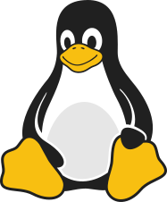
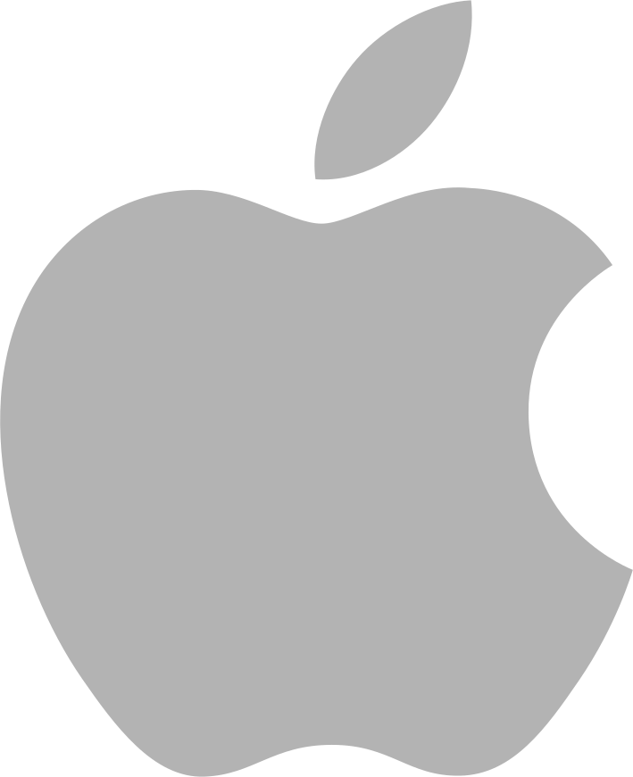
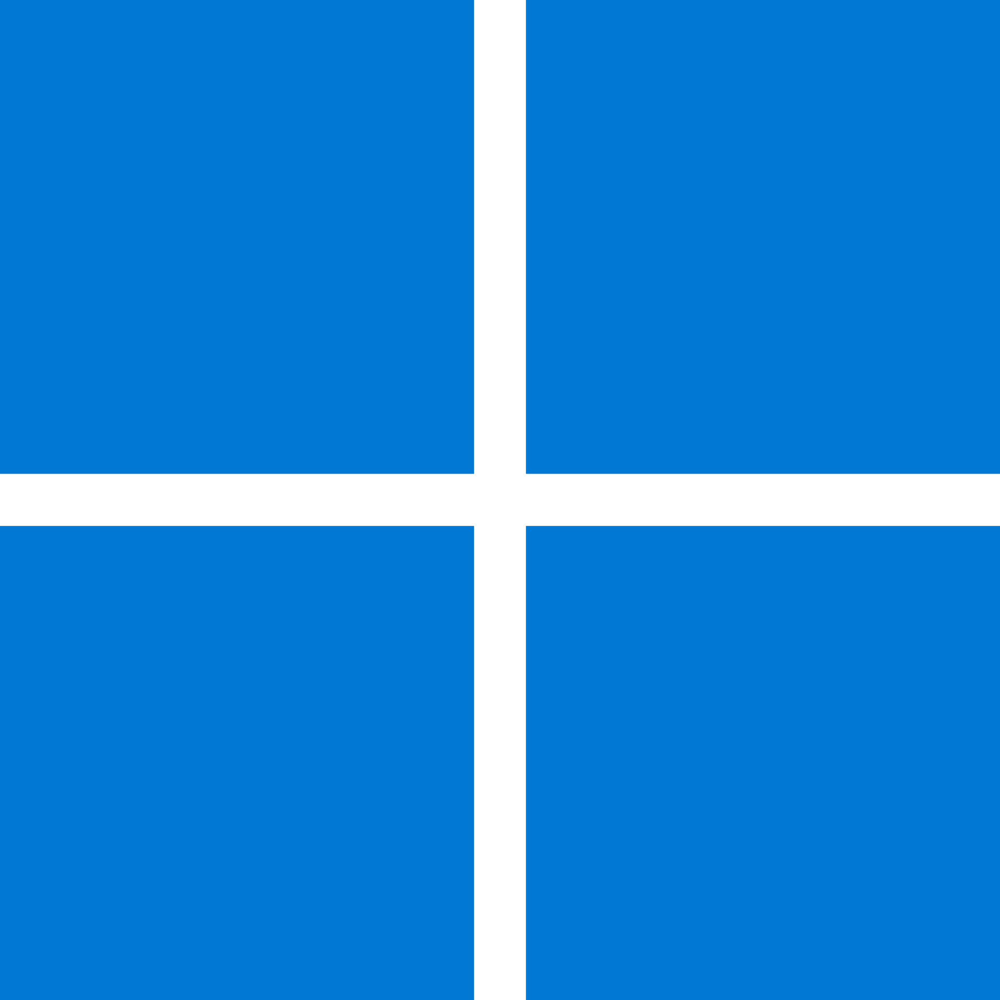
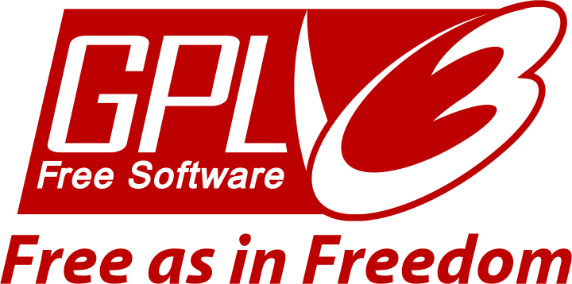

<h1 align="center">PureGlUi</h1>

<p align="center">
    <a href="https://github.com/SergioStopkin/PureGlUi/actions/workflows/actions-develop.yml" style="text-decoration: none">
        
    </a>
    &nbsp;
    <a href="https://github.com/SergioStopkin/PureGlUi/blob/develop/COPYING"
    style="text-decoration: none">
        
    </a>
    &nbsp;
    <a href="https://github.com/SergioStopkin/PureGlUi/archive/develop.zip"
    style="text-decoration: none">
        
    </a>
</p>

<p align="center">
    A domain-blind, native desktop UI framework in C++20 on EGL/OpenGL.
    <br>
    The reusable chrome - windows, menus, tabs, dialogs, themes, docks - that a
    CAD, creative, or engineering tool builds on.
    <br>
    Web-like theming, native performance.
</p>

### Key Highlights

- **Domain-blind:** knows menus, tabs, dialogs, themes, layout, and shortcuts; it never knows what an action or a "3D model" *is*. A host plugs its domain in through content surfaces + an action table.
- **Runs standalone:** `Ui::Shell` is a complete, runnable core - the `pureglui` demo opens a real window with full chrome and links **no** domain libraries (no OpenCASCADE).
- **Custom GL renderer:** SDF rounded shapes, SVG icons (librsvg/Cairo), FreeType text, batched draw - via **EGL directly** (no GLFW, no GLX).
- **Data-driven:** JSON themes, layouts, menus, dialogs, and shortcuts (CSS-inspired property names), discovered from `res/`.
- **Windowing:** custom window manager - main window + borderless popups/dialogs + host-embedded content surfaces, with Wayland compositing.
- **Platforms:** Linux (X11 + Wayland); macOS, Windows in progress. Built with Clang + CMake.

## Architecture

Two include roots with a one-way dependency (`ui -> common`):

- **`include/common/`** (`Common::`) - cross-cutting primitives (`Bit`, `Sanitize`, `Unicode`, `System`, `BackgroundWorker`). Depends on nothing.
- **`include/ui/`** (`Ui::`) - the domain-blind framework and its runnable core `Ui::Shell` (owns the resource manager, window manager, intent mapping, and action dispatch). It decides *what* to draw and *what an input means*; it never knows the domain.

A host (or the bundled `src/` demo) composes a `Ui::Shell`, registers domain actions, embeds its content surfaces (e.g. a 3D viewport), and wires a few `std::function` hooks - then the framework runs everything.

## Standard

C++ 20

## Platforms

 &nbsp;&nbsp;&nbsp;&nbsp;&nbsp;&nbsp;&nbsp;
 &nbsp;&nbsp;&nbsp;&nbsp;&nbsp;&nbsp;&nbsp;&nbsp;&nbsp;&nbsp;


Linux &nbsp;&nbsp;&nbsp;&nbsp;
macOS* &nbsp;&nbsp;&nbsp;
Windows*

<sub>* in the plans</sub>

## Quick Start

### Dependencies

```bash
./dependency.sh
```

Installs all required packages for the current platform (Linux/macOS/Windows).
Package lists are in `.github/dependencies/`.

On **Windows**, the single manual step is installing Git
(`winget install -e --id Git.Git`), which provides **Git Bash** - run all project
scripts there (they are bash scripts, not PowerShell/cmd). `dependency.sh` then
automates the rest via `dependency-windows.sh`: VS 2022 Build Tools (MSVC),
CMake, vcpkg into `C:\vcpkg`, the C++ packages, and Mesa (software OpenGL,
auto-deployed by `run.sh` only on machines without a GPU driver - VMs, CI).
Expect UAC prompts and a long first run (vcpkg builds the packages from source).

### Build

```bash
# Clone the repository
git clone https://github.com/SergioStopkin/PureGlUi.git
cd PureGlUi

# Build the demo / run the tests
./build.sh rel                              # release (the pureglui demo)
./build.sh dev                              # development (debug + ASAN)
./build.sh test                             # unit + component tests
```

## Usage

```bash
./run.sh rel                                # run the demo
./run.sh dev                                # run the development build
./run.sh test [--gtest_filter="*TestName*"] # run tests
```

The demo opens a window with the full UI chrome (top menu, toolbars, tabs,
docks, status bar). Menus, dialogs, theme switching, and shortcuts all work;
the central region stays the theme background since the demo registers no
content surfaces.

## Documentation

Developer API reference: [`doc/api/`](doc/api/README.md) - per-subsystem docs
covering the public types, signatures, and host seams, plus an architecture map
and a minimal-host example.

## Special Thanks

This project uses:
- [nlohmann/json](https://github.com/nlohmann/json) (MIT) for JSON parsing
- [FreeType](https://freetype.org/) and [librsvg](https://gitlab.gnome.org/GNOME/librsvg) + [Cairo](https://www.cairographics.org/) for text and SVG rendering
- [openMoji](https://openmoji.org/) (CC BY-SA 4.0) open source emojis

Thanks to the authors for providing this opportunity!

## License

</img>

GNU General Public License version 3 or any later version. See the [COPYING](./COPYING) file for details.

## Authors

**Sergio Stopkin** - <sergiistopkin@gmail.com> -  [GitHub](https://github.com/SergioStopkin)
